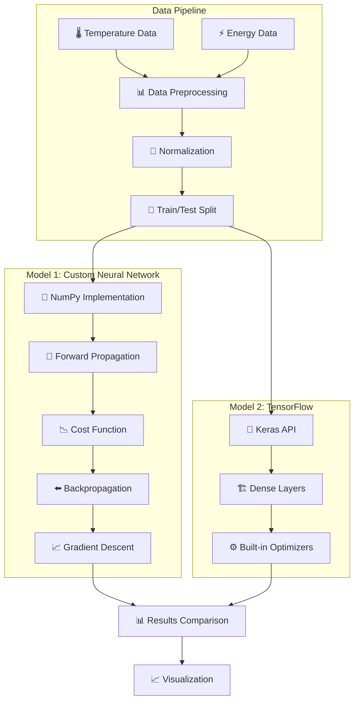

# ⚡ Energy Consumption Prediction Based on Outside Temperature

[](https://python.org)
[](https://tensorflow.org)
[](https://jupyter.org)

> Predict household energy consumption based on outside temperature using custom neural networks and TensorFlow. A comprehensive comparison of machine learning approaches for energy forecasting.

## 🚀 Features

- ✅ **Custom Neural Network** - Built from scratch using NumPy
- ✅ **TensorFlow Implementation** - Professional ML framework comparison
- ✅ **Temperature-Energy Correlation** - Clear relationship visualization
- ✅ **Gradient Descent Optimization** - Custom backpropagation algorithm
- ✅ **Performance Comparison** - Side-by-side model evaluation
- ✅ **Educational Value** - Learn ML fundamentals through implementation

## 🎯 Applications

| Sector | Use Case | Impact |
|--------|----------|--------|
| **Smart Grids** | Predict energy demand during seasonal changes | Load balancing optimization |
| **Building Management** | Optimize HVAC usage based on weather | Cost reduction |
| **Environmental Research** | Climate impact on energy patterns | Sustainability insights |
| **Education** | Hands-on ML concept demonstration | Learning tool |

## 🏗️ Architecture



## 📋 Prerequisites

- Python 3.8 or higher
- Jupyter Notebook or JupyterLab

## ⚡ Quick Start

### 1. Clone the Repository
```bash
git clone https://github.com/yourusername/energy-consumption-prediction.git
cd energy-consumption-prediction
```

### 2. Install Dependencies
```bash
pip install numpy pandas matplotlib tensorflow
```

### 3. Launch Jupyter Notebook
```bash
jupyter notebook
```

### 4. Run the Analysis
1. Open `Final (1).ipynb` in Jupyter
2. Run each cell sequentially
3. Observe training progress and compare predictions

## 📂 Project Structure

```
📁 Energy-Prediction/
│
├── Final (1).ipynb                # Main Jupyter notebook with complete code
├── data_hourly.csv               # Data file with temperature and consumption values
└── README.md                     # Project documentation (this file)
```

## 🧠 Methodology

### 📊 Dataset
- **Type**: Synthetic or real-world data with two columns:
  - `Outside Temperature (°C)`
  - `Energy Consumption (kWh)`
- **Preprocessing**:
  - Normalization for neural network input
  - Splitting into training and testing datasets

### 🛠️ Model 1: Custom Neural Network
- Implemented using **NumPy** without any external libraries
- Based on **Logistic Regression** with a single neuron
- Uses **Gradient Descent** to minimize loss
- **Components**:
  - Forward propagation
  - Cost function (Binary Cross-Entropy)
  - Backpropagation
  - Parameter updates

### ⚙️ Model 2: TensorFlow Neural Network
- Implemented using the **Keras API**
- **Comprises**:
  - Input layer
  - Dense hidden layers
  - Output layer with activation
- Trained using built-in optimizers and loss functions

### 🔍 Evaluation Metrics
- **Loss curves**
- **Prediction vs. Ground Truth**
- **Training accuracy**

## 📈 Results

- The **custom model** provides insight into the internal workings of neural networks
- The **TensorFlow model** typically achieves faster convergence and better performance due to advanced optimization techniques
- Visualization shows a clear **correlation between outside temperature and energy usage**

## 🔧 How to Run

### ✅ Requirements
```bash
pip install numpy pandas matplotlib tensorflow
```

### ▶️ Running the Notebook
1. Open `Final (1).ipynb` using Jupyter Notebook or JupyterLab
2. Run each cell sequentially:
   - The first section demonstrates the custom implementation
   - The second section implements the TensorFlow model
3. Observe training progress and compare predictions

## 🔍 Applications

- **Smart Grids**: Predict energy demand during seasonal changes
- **Building Management Systems**: Optimize HVAC usage
- **Environmental Research**: Understand how climate affects energy patterns  
- **Educational Tool**: Demonstrates core ML concepts through hands-on coding

---

<div align="center">
  <strong>Residential Energy Consumption Forecasting - Optimizing Energy Usage Through Machine Learning</strong> ⚡📊🏠
</div>
